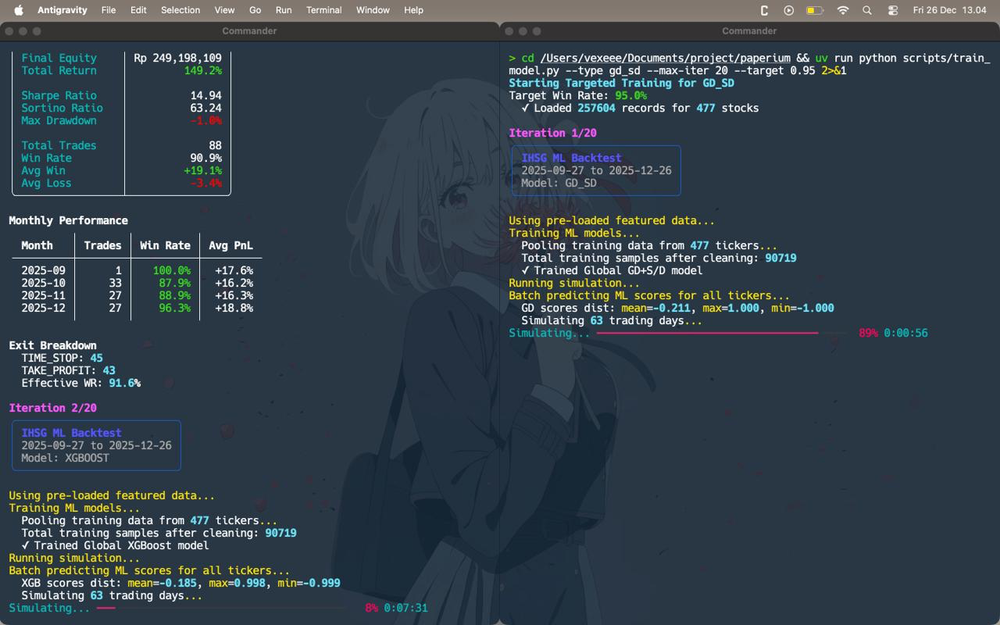

# Paperium: High-Performance IHSG Day Trading Bot



Paperium is an automated **AI-driven Day Trading system** optimized for the Indonesia Stock Exchange (IHSG). It uses a sophisticated "Dual-Brain" architecture (XGBoost + Structural GD/SD) to identify high-probability intraday setups.

Designed for both beginners and advanced traders, Paperium focuses on **high win rates (>80%)** by combining machine learning with structural price action analysis.

---

## Quick Start Guide

If you're new, the easiest way to operate Paperium is via the **Unified Runner**:

```bash
# Start the interactive dashboard
python run.py
```

This menu-driven interface will guide you through:
1.  **Morning Ritual**: Generating signals before the market opens.
2.  **Evening Update**: Updating results and retraining for tomorrow.
3.  **Model Lab**: Targeted training for specific "Champion" brains.
4.  **Global Sweep**: Automating the search for the absolute best parameters.
5.  **Backtest Lab**: Verifying model performance on historical data.

---

## Detailed Workflow

For those who want full control, here is the complete step-by-step process of running your trading floor.

### 1. Initial Setup & Data Prep
Before training any AI, you need clean data. Paperium now features **Hourly Smart Caching** to ensure you always have the latest data without hitting API limits.

```bash
# 1. Clean the stock list (removes illiquid/suspended stocks)
uv run python scripts/clean_universe.py

# 2. Fetch historical data (fills your database with years of price action)
uv run python scripts/sync_data.py
```

### 2. Training your "Brain"
You have two ways to prepare your models. The goal is to create a **"Champion"** (your best-performing model).

*   **Option A: Auto-Training (Recommended)**
    Continuously loops through parameters until it finds a model that hits the >80% win rate target.
    ```bash
    uv run python scripts/auto_train.py --days 90
    ```
*   **Option B: Targeted Training**
    Focus on a specific model type with a custom performance target.
    ```bash
    uv run python scripts/train_model.py --type xgboost --target 0.85 --days 180
    ```

### 3. Evaluating & Backtesting (The Verification Lab)
Paperium follows a **"Strict Evaluation"** policy. You cannot backtest a model that hasn't been trained yet.

*   **Evaluation Mode (Default)**: Tests your existing Champion models on a specific window.
    ```bash
    uv run python scripts/ml_backtest.py --model ensemble --start 2024-01-01 --end 2024-03-01
    ```
*   **Retrain Mode**: Specifically force a fresh training cycle before the backtest.
    ```bash
    uv run python scripts/ml_backtest.py --model xgboost --retrain
    ```

### 4. Getting Morning Signals (3-Signal Consensus)
Run this daily before the Jakarta market opens. The script now provides **Three Distinct Perspectives**:
1.  **XGBOOST**: Pure statistical probability.
2.  **GD_SD**: Pure structural supply/demand floors.
3.  **ENSEMBLE**: The high-conviction consensus of both "brains."

```bash
uv run python scripts/morning_signals.py
```

### 5. Daily Management & Retraining (EOD)
Run this after the market closes to learn from today's market.
```bash
uv run python scripts/eod_retrain.py
```
*   **Settlement**: Automatically calculates PnL for positions that hit Stop-Loss or Take-Profit.
*   **Warm Start**: Retrains the models building on existing intelligence rather than starting from scratch.

---

## Core Philosophy: The Dual-Brain

Paperium doesn't rely on just one indicator. It uses two distinct logic sets:
1.  **The Predictor (XGBoost)**: A machine learning model that looks at dozens of technical features to predict probability.
2.  **The Architect (GD/SD)**: Uses Gradient Descent to find structural Support and Demand zones. It only buys when price is at a high-conviction structural floor.

The **Ensemble** mode combines these two into a consensus model for maximum risk mitigation.

---

## Key Directories
- `/models`: Stores your `.pkl` Champion models.
- `/.cache`: Stores hourly price snapshots for faster execution.
- `/data`: Your SQLite database (`ihsg_trading.db`) containing price history.

---
*Disclaimer: Trading stocks involves significant risk. This bot is a tool for decision support. Always use Test Mode before committing to live trading.*
